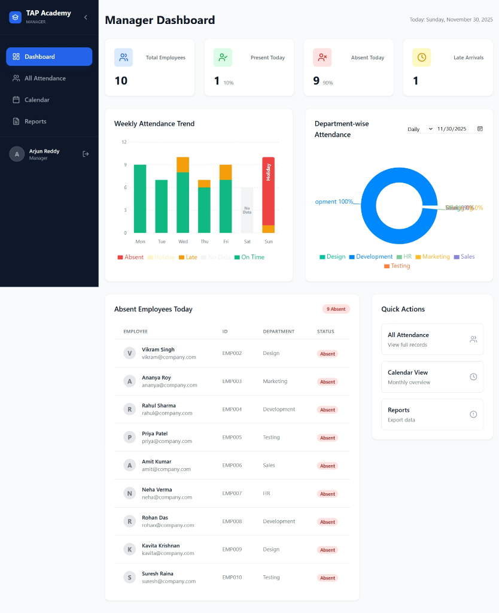
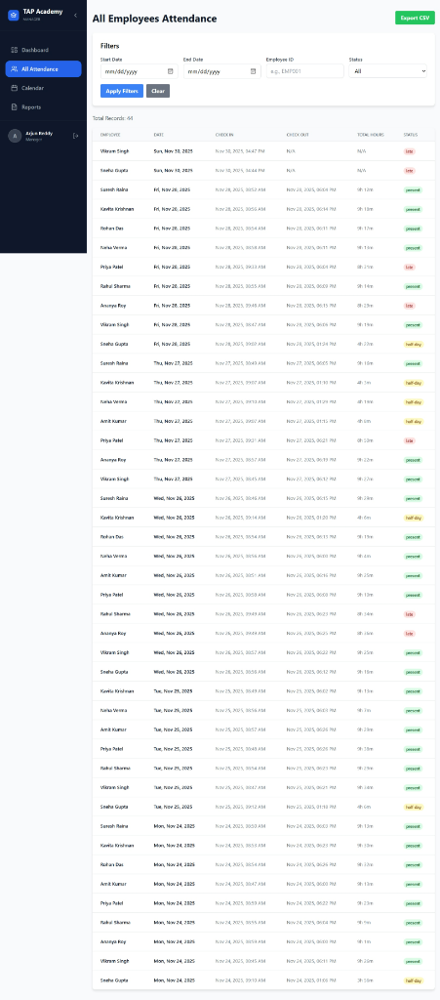
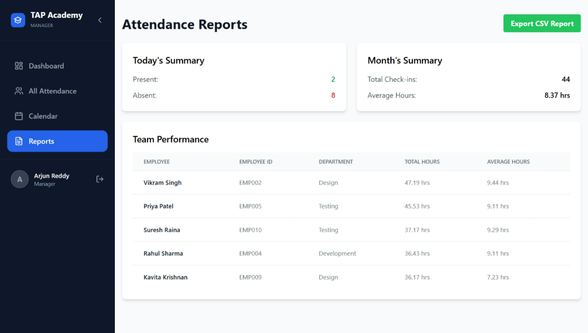

**Name:** Aravind J Naik
**College:** Shree Devi Institute of Technology Mangalore
**Contact No:** 6363986735
**Email:** naikaravind044@gmail.com

# Employee Attendance Management System

A full-stack MERN (MongoDB, Express, React, Node.js) application for managing employee attendance with role-based access control (Employee & Manager).

## 📸 Screenshots

| Manager Dashboard | Attendance List |
|-------------------|-----------------|
|  |  |

| Calendar View | Reports |
|---------------|---------|
|  |  |

| Login Page |
|------------|
|  |

## 🚀 Features

### Authentication
- User registration and login
- JWT-based authentication
- Role-based access control (Employee & Manager)

### Employee Features
- Check-in / Check-out functionality
- View today's attendance status
- View last 7 days attendance summary
- Full attendance history with pagination
- Statistics dashboard (Total Present, Half Days, Absent)

### Manager Features
- View all employees' attendance records
- Filter attendance by:
  - Date range (start date & end date)
  - Employee ID
  - Status (Present, Half Day, Absent)
- Export attendance data to CSV
- Paginated attendance list
- Visual reports and charts

## 🛠 Tech Stack

### Backend
- **Node.js** with Express.js
- **MongoDB** with Mongoose ODM
- **JWT** for authentication
- **bcryptjs** for password hashing

### Frontend
- **React 18** with Vite
- **Redux Toolkit** for state management
- **React Router** for navigation
- **Axios** for API calls
- **Tailwind CSS** for styling
- **Recharts** for data visualization

## ⚙️ Setup Instructions

### Prerequisites
- Node.js (v16 or higher)
- MongoDB (local installation or MongoDB Atlas)
- npm or yarn

### 1. Backend Setup

Navigate to the server directory and install dependencies:

```bash
cd server
npm install
```

Create a `.env` file in the `server` directory with the following variables:

```env
PORT=5000
MONGODB_URI=mongodb://localhost:27017/employee-attendance
JWT_SECRET=your-super-secret-jwt-key-change-this-in-production
NODE_ENV=development
```

Seed the database with test data (creates Manager and Employee accounts):

```bash
npm run seed
```

Start the backend server:

```bash
npm run dev
```
*Server runs on http://localhost:5000*

### 2. Frontend Setup

Open a new terminal, navigate to the client directory and install dependencies:

```bash
cd client
npm install
```

Create a `.env` file in the `client` directory:

```env
VITE_API_URL=http://localhost:5000/api
```

Start the frontend development server:

```bash
npm run dev
```
*Application runs on http://localhost:5173*

## 🔑 Test Credentials

After running `npm run seed`, use these credentials to log in:

### Manager Account
- **Email:** `manager@company.com`
- **Password:** `manager123`
- **Employee ID:** MGR001

### Employee Accounts
- **Email:** `sneha@company.com`
- **Password:** `employee123`
- **Employee ID:** EMP001

- **Email:** `vikram@company.com`
- **Password:** `employee123`
- **Employee ID:** EMP002

*(All 10 seeded employees use the password `employee123`)*

## 📂 Project Structure

```
TapAcademyTask/
├── server/                 # Backend application
│   ├── config/            # Database configuration
│   ├── controllers/       # Route controllers
│   ├── middleware/        # Auth middleware
│   ├── models/            # Mongoose models
│   ├── routes/            # API routes
│   ├── seed.js            # Database seeder script
│   └── server.js          # Entry point
│
└── client/                 # Frontend application
    ├── src/
    │   ├── components/    # Reusable UI components
    │   ├── features/      # Feature-based modules (Auth, Attendance)
    │   ├── pages/         # Main pages
    │   ├── store/         # Redux store configuration
    │   └── utils/         # Helper functions
    └── public/            # Static assets
```

## 📝 API Endpoints

### Authentication
- `POST /api/auth/login` - Login user
- `GET /api/auth/me` - Get current user profile

### Employee
- `POST /api/attendance/checkin` - Check-in
- `POST /api/attendance/checkout` - Check-out
- `GET /api/attendance/my-history` - View personal history
- `GET /api/attendance/my-summary` - View personal stats

### Manager
- `GET /api/attendance/all` - View all attendance
- `GET /api/attendance/export` - Export CSV
- `GET /api/attendance/summary` - View overall stats
- `GET /api/attendance/today-status` - View today's status

## 📄 License

This project is open source and available for educational purposes.


